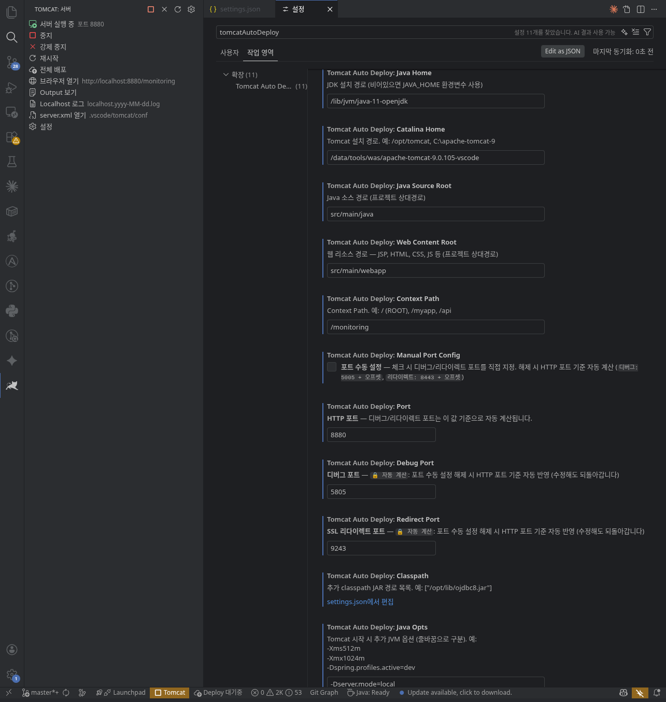

[한국어](README_ko.md)

# Tomcat Auto Deploy

A VS Code extension that **automatically compiles and deploys** your Java web application to a local Tomcat server every time you save a file — with zero restarts.

Save a `.java` file, and it gets compiled and hot-swapped into the running JVM instantly. Save a `.jsp`, `.html`, `.css`, or `.js` file, and it's copied to the deployment directory right away. No need to restart Tomcat, no need to redeploy the WAR.

> [!TIP]
Develop without restarting Tomcat — class hot-deploy works right in VS Code.  
Hot Swap is based on the standard JVM JDWP HotSwap mechanism, which is more limited in scope compared to JRebel.  
Upon recompilation, only the bytecode of changed method bodies is replaced in-place, using the standard JVM JDWP debug hot swap mechanism.  
(Adding new fields, changing method signatures, or modifying class structure requires a full application restart.)

## How It Works

```
You save a .java file
        │
        ▼
   javac compiles it
        │
        ▼
   JDWP HotSwap replaces the class
   in the running JVM (no restart)
        │
        ▼
   Changes are live immediately
```

For static files (JSP, HTML, CSS, JS, images, etc.), saving simply copies the file to the Tomcat deployment directory — changes are reflected on the next browser refresh.

## Features

- **Instant Java HotSwap** — Compile on save + JDWP class replacement, no Tomcat restart needed
- **Static file deployment** — JSP, HTML, CSS, JS files are deployed immediately on save
- **Maven & Gradle support** — Dependencies are automatically resolved and added to the classpath
- **Java version detection** — Reads `source`/`target` from `pom.xml` or `build.gradle` to ensure bytecode compatibility
- **Tomcat lifecycle management** — Start, stop, restart, force kill from the status bar or sidebar
- **Orphan process detection** — Finds Tomcat processes left running from a previous session
- **Real-time log streaming** — Tomcat stdout and `localhost.log` displayed in dedicated output panels
- **Cross-platform** — Windows, Linux, macOS

## Installation

### From VS Code Marketplace

- **Inside VS Code:** Open the Extensions panel (`Ctrl+Shift+X`) and search for `Tomcat Auto Deploy`
- **Web:** Search for `Tomcat Auto Deploy` on the [Visual Studio Marketplace](https://marketplace.visualstudio.com/vscode)

### Build from Source

#### 1. Package

```bash
# Linux / macOS
./package.sh

# Windows
package.bat
```

#### 2. Install in VS Code

**Option A) Install from UI:**

1. Open the Extensions panel in VS Code (`Ctrl+Shift+X`)
2. Click the `···` menu at the top
3. Select **Install from VSIX...**
4. Choose the generated `.vsix` file

**Option B) Install from command line:**

```bash
code --install-extension tomcat-auto-deploy-0.0.1.vsix
```

## Getting Started

### 1. Set `catalinaHome`

On first activation, the extension creates a settings template in `.vscode/settings.json`. You only need to set one thing — the path to your Tomcat installation:

```json
{
  "tomcatAutoDeploy.catalinaHome": "/path/to/apache-tomcat-9.x"
}
```

### 2. Start Tomcat

Click the **Tomcat** button in the status bar, or run `Tomcat: Start` from the Command Palette (`Ctrl+Shift+P`).

The extension will:
1. Initialize a local Tomcat base directory (`.vscode/tomcat/`)
2. Sync all compiled classes, dependencies, and static files
3. Start Tomcat in JPDA debug mode (for HotSwap)
4. Open your browser when Tomcat is ready

### 3. Edit and Save

Just write code and save. That's it.

- **Java files** → compiled → hot-swapped into the running JVM
- **JSP / HTML / CSS / JS** → copied to the deployment directory

## Settings

All settings live under `tomcatAutoDeploy.*` in your workspace settings (`.vscode/settings.json`).

You can also open the settings GUI via Command Palette → `Tomcat: Open Settings` or the gear icon in the sidebar.



| Setting | Required | Default | Description |
|---------|----------|---------|-------------|
| `catalinaHome` | **Yes** | — | Path to your Tomcat installation (CATALINA_HOME) |
| `javaHome` | Recommended | env var | Path to JDK (uses `JAVA_HOME` if not set) |
| `port` | | 8080 | HTTP port — debug/redirect ports are auto-calculated based on this value |
| `debugPort` | | 5005 | JPDA debug port — auto-calculated from HTTP port when manual config is off |
| `redirectPort` | | 8443 | SSL redirect port — auto-calculated from HTTP port when manual config is off |
| `contextPath` | | `/` | Web application context path |
| `javaSourceRoot` | | `src/main/java` | Java source root (relative to workspace) |
| `webContentRoot` | | `src/main/webapp` | Static files root (relative to workspace) |
| `resourceRoot` | | `src/main/resources` | Resource path — `.xml`, `.properties`, etc. deployed to `WEB-INF/classes` (relative to workspace) |
| `manualPortConfig` | | `false` | Manual port config — when checked, debug/redirect ports are set manually. When unchecked, auto-calculated from HTTP port |
| `classpath` | | `[]` | Additional JAR paths to include in compilation |
| `javaOpts` | | `""` | Extra JVM options passed to Tomcat (separated by newlines) |

## Commands

Available from the Command Palette (`Ctrl+Shift+P`) and the sidebar:

| Command | Description |
|---------|-------------|
| Tomcat: Start | Start Tomcat in debug mode |
| Tomcat: Stop | Gracefully stop Tomcat |
| Tomcat: Force Stop | Kill the Tomcat process immediately |
| Tomcat: Restart | Stop and start Tomcat |
| Tomcat: Open Browser | Open `http://localhost:{port}` in your browser |
| Tomcat: Show Output | Show the main log panel |
| Tomcat: Localhost Log | Show Tomcat's `localhost.log` in a dedicated panel |
| Tomcat: Open server.xml | Open the generated `server.xml` for editing |
| Tomcat: Deploy All | Re-run full sync (`Ctrl+Alt+D`) |
| Tomcat: Open Settings | Open workspace settings filtered to this extension |

## Status Bar

| Display | Meaning |
|---------|---------|
| `▶ Tomcat` | Stopped — click to start |
| `● Tomcat` (orange) | Running — click to stop |
| `✔ Deploy: Foo.java` | File compiled and deployed successfully |
| `✖ Deploy: Foo.java` (red) | Compilation failed — check the Output panel |

## Sidebar

The Tomcat panel in the Activity Bar provides quick access to all server controls, log panels, and settings.

## HotSwap Limitations

JDWP HotSwap is a JVM feature with inherent limitations. Understanding what it can and cannot do will save you from confusion:

**Works (no restart needed):**
- Changing code inside a method body
- Modifying log statements, fixing bugs, tweaking logic

**Doesn't work (Tomcat restart required):**
- Adding or removing methods
- Adding or removing fields
- Changing method signatures
- Changing class hierarchy (extends/implements)
- Adding or removing lambda expressions (they compile to synthetic methods)

When HotSwap fails, you'll see a warning in the Output panel. Just restart Tomcat to pick up the changes.

## Build Tool Integration

### Maven

- Dependencies are resolved via `mvn dependency:build-classpath` and cached
- Java `source`/`target` version is read from `pom.xml` (properties or `maven-compiler-plugin` config)
- Run `mvn compile` once before first use (the extension syncs from `target/classes`)
- Changing `pom.xml` automatically invalidates the dependency cache

### Gradle

- Dependencies are resolved via a temporary init script that prints `compileClasspath`
- Java version is read from `sourceCompatibility`/`targetCompatibility` or `javaToolchain`
- Run `gradle compileJava` once before first use (the extension syncs from `build/classes`)
- Changing `build.gradle` or `build.gradle.kts` automatically invalidates the dependency cache

### No Build Tool

If there's no `pom.xml` or `build.gradle`, the extension compiles all `.java` files directly with `javac`.

## Good to Know

- The `.vscode/tomcat/` directory is the local Tomcat base — add it to `.gitignore`
- Tomcat's `servlet-api` and other libraries are automatically included in the classpath
- Compilation errors are shown in the Output panel (`Tomcat Auto Deploy`)
- If VS Code crashes, the extension will detect the orphan Tomcat process on next startup and offer to kill it
- `Java Opts` 설정에 `-Dfile.encoding=UTF-8` 등 인코딩 옵션이 기본 포함되어 있습니다 (필요 시 수정 가능)

## License

This project is licensed under the [Apache License 2.0](LICENSE).
